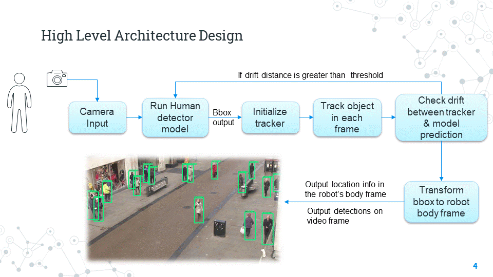

# Human_Detection_Tracking-CPP
A C++ module to detect and track humans which outputs location information directly in a robot's reference frame.

## Introduction
This repository contains a robust human obstacle detector and tracker using a monocular camera, directly usable in a robot’s reference frame.

The initial design is as follows : 

*Fig 1 :  High Level Arhitecture Design*

## Currently under development in the "development" branch [here](https://github.com/llDev-Rootll/Human_Detection_Tracking-CPP/tree/development)
