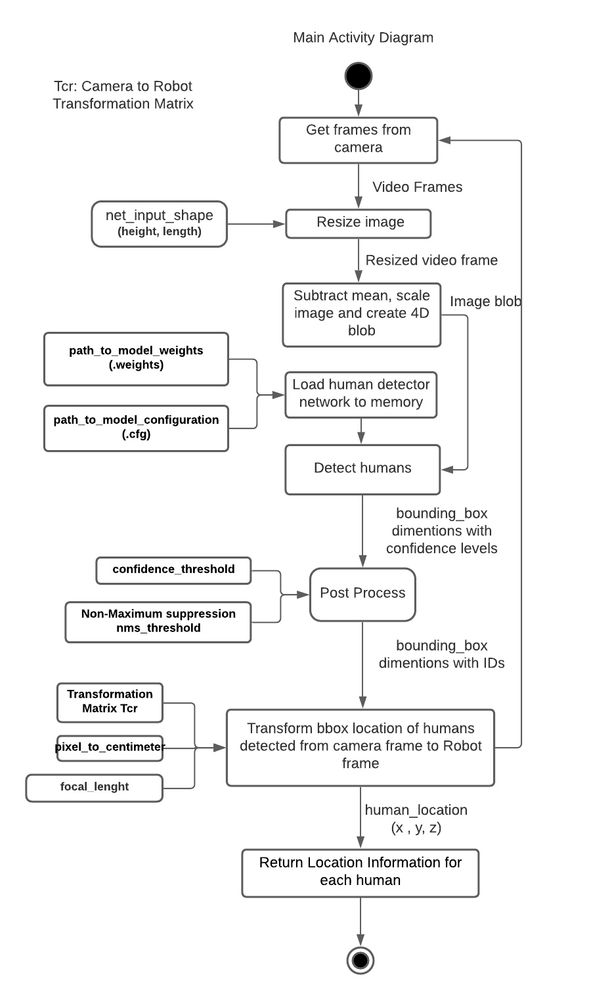

# Human_Detection_Tracking-CPP
[](https://app.travis-ci.com/llDev-Rootll/Human_Detection_Tracking-CPP)
[](https://coveralls.io/github/llDev-Rootll/Human_Detection_Tracking-CPP?branch=master)
[](https://opensource.org/licenses/MIT)

A C++ module to detect and track humans which outputs location information directly in a robot's reference frame.

## Authors

 - Arunava Basu (Navigator)
 - Aditi Ramadwar (Driver)

## Introduction
Human detection or person detection is the computer vision task of the localization and classification of human being(s) in an image. This is a key part in robotic applications for various reasons such as safety, obstacle avoidance, collaborative robotics, etc. 

We aim to design and deliver a robust  robust human obstacle detector and tracker using a monocular camera, directly usable in a robot’s reference frame according to the requirement specifications provided to us by ACME robotics's RnD division for integration into a future product.

Our system is built using C++ and will employ the robust YOLOv3 neural network model trained on the COCO dataset for human detection and tracking as it is one of the most accurate real-time object detection algorithms. A one time calibration is performed to calculate certain calibration metrics for the transformation of location info into the camera frame. An image from a monocular camera is pre-processed and passed to the model which outputs the location info in the image frame. It is then converted to the camera frame by using the calibration constants and then transformed into the robot's frame.

## Project Collaterals
The Agile Iterative Process will be used for the development of this system consisting of two sprints.

The project proposal can be found [here](https://github.com/llDev-Rootll/Human_Detection_Tracking-CPP/blob/development/assets/Human%20Detector%20%26%20Tracker%20-%20Proposal.pdf).

The quad chart can be found [here](https://github.com/llDev-Rootll/Human_Detection_Tracking-CPP/blob/development/assets/Quad_Chart.pdf).

The overall backlog table and the tables for each sprints can be found [here](https://docs.google.com/spreadsheets/d/1tjJKUd9B4bBSYAHnrwuMjWNl_lUBmqeB6lw7iTNKZSg/edit?usp=sharing).

## Requirements
| Name | Version | 
| :---         |     :---:      |    
| C++   | 14++     | 
| CMake   | min 3.2.1     | 

Continuous integration is tracked by using Travis CI and code coverage is tracked using coveralls. 
## Dependencies

| Name | Version | License |
| :---         |     :---:      |          ---: |
| OpenCV   | 4.5.1     | [Apache 2](https://github.com/opencv/opencv/blob/master/LICENSE)    |
| Eigen     | 3.X.X       | [MPL2](https://www.mozilla.org/en-US/MPL/2.0/FAQ/)      |

Run this command in the root directory to install the dependencies : 
```
chmod a+x scripts/install_dependencies.sh
./scripts/install_dependencies.sh
```

## System Architecture 
The following shows the activity diagram for our proposed schema : 


*Fig 1 :  Activity Diagram*

The corresponding class diagram can be found [here](https://github.com/llDev-Rootll/Human_Detection_Tracking-CPP/blob/development/UML/revised/Revised_Class_Diagram.pdf).
## Testing
Unit Testing will be used to test each submodule and ensure complete code coverage. For this Google Gtest will be leveraged and identical test classes and methods will be created with minimal modification in order to facilitate testing.

Additionally, a small test subset of the COCO test data will be used to validate model accuracy.

## Building without code coverage
Execute these commands in the root folder : 
```
chmod a+x scripts/build_without_coverage.sh
./scripts/build_without_coverage.sh
```
## Building with code coverage

Execute these commands in the root folder : 
```
sudo apt-get install lcov
chmod a+x scripts/build_with_coverage.sh
./scripts/build_with_coverage.sh
```
## Phase 1

 - Defined Robot, HumanDetector and test classes according to the UML diagrams.
 - Implemented all Robot and HumanDetector methods except for transformToRobotFrame method.
 - Definition and implementation of test cases are planned for Phase 2.
 Please refer to the backlog table, [here](https://docs.google.com/spreadsheets/d/1tjJKUd9B4bBSYAHnrwuMjWNl_lUBmqeB6lw7iTNKZSg/edit?usp=sharing), for an exhaustive list tasks completed in Phase 1.  

