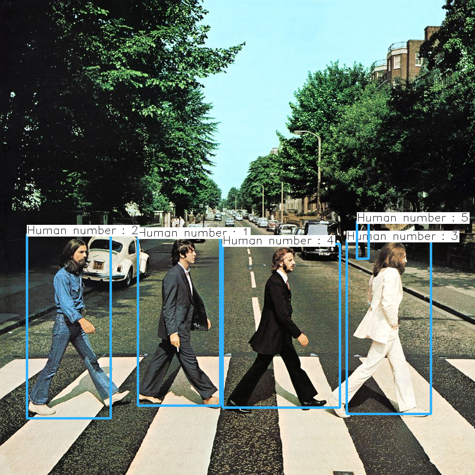
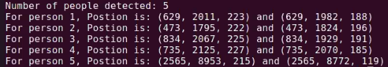
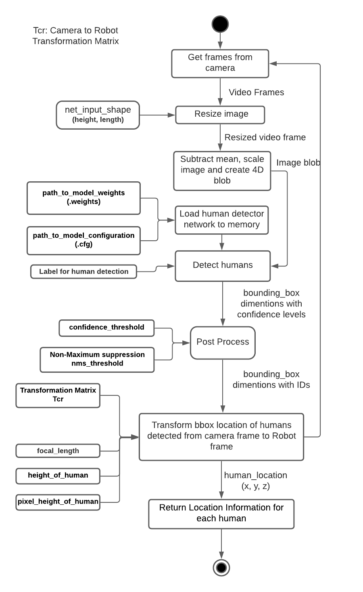

  
# Human_Detection_Tracking-CPP
[](https://app.travis-ci.com/llDev-Rootll/Human_Detection_Tracking-CPP)
[](https://coveralls.io/github/llDev-Rootll/Human_Detection_Tracking-CPP?branch=master)
[](https://opensource.org/licenses/MIT)

A C++ module to detect and track humans which outputs location information directly in a robot's reference frame.

## Authors
Sprint 1 -
 - [Arunava Basu](https://www.linkedin.com/in/abasu713/) (Navigator)
 - [Aditi Ramadwar](https://st1.zoom.us/web_client/5g6glw/html/externalLinkPage.html?ref=https://www.linkedin.com/in/aditiramadwar/) (Driver)

Sprint 2 -
 - [Arunava Basu](https://www.linkedin.com/in/abasu713/) (Driver)
 - [Aditi Ramadwar](https://st1.zoom.us/web_client/5g6glw/html/externalLinkPage.html?ref=https://www.linkedin.com/in/aditiramadwar/) (Navigator)
## Introduction
Human detection or person detection is the computer vision task of the localization and classification of human being(s) in an image. This is a key part in robotic applications for various reasons such as safety, obstacle avoidance, collaborative robotics, etc. 

We aim to design and deliver a robust  robust human obstacle detector and tracker using a monocular camera, directly usable in a robot’s reference frame according to the requirement specifications provided to us by ACME robotics's RnD division for integration into a future product.

Our system is built using C++ and will employ the robust YOLOv3 neural network model trained on the COCO dataset for human detection and tracking as it is one of the most accurate real-time object detection algorithms. An image from a monocular camera is pre-processed and passed to the model which outputs the location info in the image frame. It is then converted to the camera frame by using the calibration constants and then transformed into the robot's frame.

## Sample result 
The boxes in the image frame can be seen as :



The location information in the robot frame can be seen as :



## Project Collaterals
The Agile Iterative Process will be used for the development of this system consisting of two sprints.

The project proposal can be found [here](https://github.com/llDev-Rootll/Human_Detection_Tracking-CPP/blob/master/assets/Human%20Detector%20%26%20Tracker%20-%20Proposal.pdf).

The quad chart can be found [here](https://github.com/llDev-Rootll/Human_Detection_Tracking-CPP/blob/master/assets/Quad_Chart.pdf).

The overall backlog table and the tables for each sprints can be found [here](https://docs.google.com/spreadsheets/d/1tjJKUd9B4bBSYAHnrwuMjWNl_lUBmqeB6lw7iTNKZSg/edit?usp=sharing).

## Requirements
| Name | Version | 
| :---         |     :---:      |    
| C++   | 14++     | 
| CMake   | min 3.2.1     | 

Continuous integration is tracked by using Travis CI and code coverage is tracked using coveralls. 
## Dependencies

| Name | Version | License |
| :---         |     :---:      |          ---: |
| OpenCV   | 4.5.1     | [Apache 2](https://github.com/opencv/opencv/blob/master/LICENSE)    |
| Eigen     | 3.X.X       | [MPL2](https://www.mozilla.org/en-US/MPL/2.0/FAQ/)      |

Run this command in the root directory to install the dependencies : 
```
sh install_dependencies.sh
```

## System Architecture 
The following shows the activity diagram for our proposed schema : 


*Fig 1 :  Activity Diagram*

The corresponding class diagram can be found [here](https://github.com/llDev-Rootll/Human_Detection_Tracking-CPP/blob/master/UML/revised_Phase_2/Class_Diagram_Phase_2.pdf).

## Few key points in the implementation
### Depth estimation in monocular camera
The depth was calculated by estimating the focal length of a camera using the pixel height of a bounding box enclosing a human and considering the real-life height to be 171.45 cm which is the mean height of a person in the US. The focal length can be changed using the setter function as per need.

Consequently the distance is calculated for each detected human as :

    Depth = 171.45 * Estimated_focal_length / Pixel_height_of_bbox_around_a_human

### Output data format explained
At the output of the Human Detection module from the `detectHumans` method we get a vector of Rects ('Rect' is a data type in OpenCV). 

The structure of Rect is: (x, y, z, redundant); It has four parameters, 
the first three parameters indicate the coordinates of a point in terms of robot's reference frame (x, y, z)

These coordinates can be extracted from the Rect and used as per application.
The redundant variable is part of the transformation vector which is not useful for us for showing the location of the human detected.

For each person detected in frame, two Rects are created. We are taking two location points of each human detected. To get an estimated location of the human in the entire frame, we need to extract the x, y, z coordinates from both the Rects created where, 
x is the distance of the human from the robot's reference frame, 
y is the horizontal component and 
z is the  vertical component.

Example:
If there are two humans detected in a frame, then we will get a vector of four Rects. Consider the output vector variable we got is 'positions'. Size of positions is 4 since in our example 2 humans are detected, then, first human's location will be extracted from Rects positions[0] and positions[1]
second human's location will be extracted from Rects positions[2] and positions[3]
Example for location extraction of one of the coordinates of the first human:

> 	  x = position[0] (0) 			
>         y = position[0] (1) 			
>         z = position[0] (2)

## Steps to Run the demo application
Run the following commands in the root folder to build and run the Human Detector and Tracker

    sh getModels.sh
    sh build_with_coverage.sh
    sh run_app.sh
With the output window in focus, press `Esc` to terminate the application.

## Running Unit tests
Unit Testing will be used to test each submodule and ensure complete code coverage. For this Google Gtest will be leveraged and identical test classes and methods will be created with minimal modification in order to facilitate testing.
Execute these commands in the root folder to run the test cases: 
```
sh run_tests.sh
```
A final test case was written to check for the accuracy of detection with a certain margin of error by calculating the euclidean distance between the detected centroids and the ground truth centroids. Ground truth data was obtained by manually annotating the capture image using [Labelmg](https://github.com/tzutalin/labelImg).

## Running cpplint & cppcheck tests
Run the following command in the root directory to generate cpplint results in **results** folder

    sh run_cpplint.sh
 
Run the following command in the root directory to generate cppcheck results in **results** folder

    sh run_cppcheck.sh

## Building without code coverage
Run the following command in the root folder : 
```
 sh build_without_coverage.sh
```
## Building with code coverage

Run these commands in the root folder : 
```
sudo apt-get install lcov
sh build_with_coverage.sh
```
## Generate Doxygen documentation
Run the following command in the root folder to generate the documentation in the `docs` folder:

    sh create_doxy_docs.sh
## Known Issues and bugs

 - Depth estimation assumes that the camera and the human are on the same plane, the human is standing upright and there is no occlusion present.
 -  API can be made more robust by using more complex methods of depth estimation.
 - Average human height is assumed to be 171.45 cm, which is the average in the US.

## Phase 1

 - Defined Robot, HumanDetector and test classes according to the UML diagrams.
 - Implemented all Robot and HumanDetector methods except for transformToRobotFrame method.
 - Definition and implementation of test cases are planned for Phase 2.
 Please refer to the backlog table, [here](https://docs.google.com/spreadsheets/d/1tjJKUd9B4bBSYAHnrwuMjWNl_lUBmqeB6lw7iTNKZSg/edit?usp=sharing), for an exhaustive list of tasks completed in Phase 1.
## Phase 2
 - Test classes created in Phase 1 were removed after careful considerations
 - 	Setter and getter methods were created for helper functions
 - A proper structure for testing each class was created
 - transformToRobotFrame was implemented
 -  A method for depth calculation was created
 - Unit tests for all methods were created
 -  UMLs were revised	
 - Generated github and doxygen documentation
 - All requirements were successfully delivered
Please refer to the backlog table, [here](https://docs.google.com/spreadsheets/d/1tjJKUd9B4bBSYAHnrwuMjWNl_lUBmqeB6lw7iTNKZSg/edit?usp=sharing), for an exhaustive list of tasks completed in Phase 2.		

